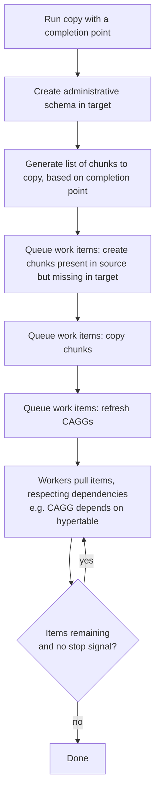

# Backfill tool design document

> Historical design record migrated from Slab (2026-07). The tool shipped (timescaledb-backfill v0.14.0 per Cargo.toml).

> Editorial note: this document is preserved as written during design and does
> not describe current behavior. Two things drifted since:
> 1. The shipped CLI splits work into `stage` / `copy` / `clean` (plus `verify`),
>    not the `copy` / `clean` two-command model described below. See
>    [`README.md`](../../README.md) for current usage.
> 2. It references [Hypershift](https://github.com/timescale/hypershift), which
>    is now legacy: not GA and no longer a recommended production migration tool.

## Ubiquitous language

- [Hypershift](https://github.com/timescale/hypershift): migration tool developed by TimescaleDB. Not fully GA'd and no longer considered a recommended production migration tool.
- Source Database: The existing database that is undergoing migration. It is the database from which the data will be extracted and transferred to the target database.
- Target Database: The destination database where the migrated data will be stored. It is the database that will receive the data from the source database during the migration process.
- Backfill: the process of retroactively populating or updating data.
- Dual-write: the process of simultaneously writing data changes to multiple systems or databases in real-time.
- Append-only workload: data operations or systems where new data is continually added to the existing dataset without modifying or deleting existing data. In an append-only workload, data is only appended or appended and read, but never modified or removed.
- Completion point: timestamp indicating the moment in time until which data will be backfilled.
- Backfill session: process of transferring data from the source to the target, persisting until all necessary data has been successfully copied. Allows for pausing and resuming to continue from the previous state. The session is deemed complete when all data from the source Hypertables up to the specified completion point has been successfully replicated to the target.

## Related documents

- Miro design diagram — external diagram; not migrated from Slab (Miro content cannot be fetched or rendered here). *[diagram placeholder]*

## Problem

Migrating a sizeable database by performing a complete dump of the source and restoring it to the target database has considerable disadvantages. The typical process involves:

- Put source DB in read-only mode or stop all client connections.
- Create a dump of the entire database.
- Restore the dump to the target database.
- Switch the application to use the target database.

As the size of the source database increases, the time required to generate the dump and restore it to the target also increases. Consequently, the source database has to remain offline or in read-only mode for an extended period.

To mitigate these challenges and minimize downtime during migration, we currently recommend a dual-write approach combined with backfilling to our customers. This strategy involves the following steps:

- Put the source database in read-only mode or stop all client connections.
- Create dump of just the metadata tables. We expect these to have a relatively small combined size.
- Restore the metadata dump to the target database.
- Start the application and enable writing to both the source and target databases simultaneously.
- Backfill the Hypertables with the remaining data.
- Switch the application to use the target database.

The key difference in this approach is that we anticipate the majority of the data to be stored in the Hypertables. By migrating only the metadata tables, which can be accomplished much faster than moving the entire database, we significantly reduce the migration time.

It's worth noting that this method is specifically designed for workloads consisting of append-only Hypertables with a few smaller metadata tables, a common scenario among our customers. While this approach offers advantages, it also comes with some drawbacks such as requiring changes to client code and potential implications on data consistency guarantees.

The main issue we want to address is the user experience of backfilling. Currently, we require our customers to export their data into CSV files and subsequently restore from them. Dealing with these files can be painful, for the following reasons:

- Compressed data is dumped to CSVs in decompressed form. This increases network transfer, requires more interim space to store the CSVs, and requires care to restore the data in compressed form.
- Migrating the data by time ranges has to be handled by the user. There's no automated tool, although it can be achieved by scripting a custom solution.
- Interruptions and connection errors while backfilling would need manual intervention to clean up. Like the previous point, it can be achieved by scripting a custom solution.

## Current architecture

The closest thing to backfilling is in the [migrate schema then data](https://docs.timescale.com/self-hosted/latest/migration/schema-then-data/) section of the Timescale documentation. The gist is to migrate the schema with pg_dump, then for each table, dump the data to a CSV and load with timescaledb-parallel-copy.

As far as backfilling, the documentation has a note to move from:

```
\COPY (SELECT * FROM <TABLE_NAME>) TO <TABLE_NAME>.csv CSV
```

To:

> If your tables are very large, you can migrate each table in multiple pieces. Split each table by time range, and copy each range individually. For example:

```
\COPY (SELECT * FROM <TABLE_NAME> WHERE time > '2021-11-01' AND time < '2011-11-02') TO <TABLE_NAME_DATE_RANGE>.csv CSV
```

This approach suffers from the issues described in the problems section.

## Proposed solution

The tool follows closely the Hypershift approach. It incorporates an administrative schema that resides within the Target database and serves two key roles. Firstly, it functions as the application state repository. Secondly, it acts as a queue, retrieving work items to be executed.

The particularity of the tool is that it will backfill only Hypertables, while managing their particularities, like compression, triggers, if they belong to a CAGGs. The data will be copied on a per chunk basis, this will be our unit of parallelism.

By copying directly from one chunk to another, the need for intermediate storage is removed. More importantly, compressed to compressed chunk migration happens without having to decompress the data before insertion like the [TimescaleDB docs suggest](https://docs.timescale.com/self-hosted/latest/migration/schema-then-data/#copy-data-from-the-source-database).

Users are required to specify a completion point, which is a timestamp indicating the moment in time until which data will be backfilled. The tool will exclusively copy data that predates the completion point.

The tool is designed so that it can be executed at any point in time during the migration process. It takes into account chunks that exist in source that might not exist on target; this could be due to compression, chunk interval, etc. It's not required to execute just before enabling dual writes.

A high-level overview of the workflow:



1. The tool is executed with the copy command and given a completion point.
1. The administrative schema is created in the target.
1. A list of chunks that need to be copied based on the completion point is generated and stored in the administrative schema.
1. Work items for creating chunks that exist on source and not on target are added to the work queue.
1. Work items for chunks that should be copied are added to the work queue.
1. Work items for refreshing CAGGs are added to the work queue.
1. Workers take work items from the work queue respecting dependencies (Ex: CAGG depends on Hypertable).
1. Workers process work items until there are no more left or a signal to stop is received.

Following is a detailed breakdown of the workflow. Each section is defined in a way that it can be developed in parallel, the only requirement is to define the APIs and data structures that are going to be exposed by each section.

### Commands, configurations and restarts

The tool comprises two commands: "clean" and "copy."

The "copy" command is responsible for preparing and executing the backfilling session. Upon startup, it detects whether it is a new backfilling session starting from scratch or a continuation of a previous session. In the case of a continuation, it directly resumes working on the existing work items without needing to create new ones.

The "clean" command ensures a fresh backfilling session by providing a clean slate to begin with.

#### Configuration

The "clean" command doesn't take any configuration arguments.

The "copy" command accepts the following flags:

| **Long** | **Short** | **Default** | **Description** | **Required** | **Stored in Target** |
| --- | --- | --- | --- | --- | --- |
| --target | -t | N/A | Target's connection string | x |  |
| --source | -s | N/A | Source's connection string | x |  |
| --parallel | -p | 8 | Work items that will be worked on in parallel. |  |  |
| --until | -u | N/A | Completion point. | x | x |

Configuration options can also be set as environment variables using the format `{tool_name}_{long_flag}`.

TBD: using `--config-file` to have the config as yaml; we already have the code in hypershift and we can copy it over.

#### Restarts

The completion point is stored in the administrative schema within a table called "configuration." As a rule, any "copy" invocation intending to continue a previous backfilling session must specify the same completion point value. Otherwise, it is considered an error, and execution is aborted. This constraint is enforced to eliminate ambiguity regarding the outcome when different values are specified in different invocations.

The existence of the administrative schema and the validation of the completion point indicates that a previous backfilling session is being continued, eliminating the need to inspect the source and target to create new work items.

To initiate a new session with a different completion point, the "clean" command must be executed beforehand.

**Example of simple once-through:**

```
> backfill copy --source <source> --target <target> \
  --until '2023-06-01 12:00:00Z' \
  --parallel 2
... finished
> backfill clean --target <target>
```

**Example of interrupt execution:**

```
> backfill copy --source <source> --target <target> \
  --until '2023-06-01 12:00:00Z' \
  --parallel 2
running...
# ctrl-c here
finishing copy...
done

# re-run with different until
> backfill copy --source <source> --target <target> \
  --until '2023-07-01 12:00:00Z' \
  --parallel 2
ERROR: until changed, please run `backfill clean`

# remove administrative schema (__backfill)
> backfill clean --target <target>

# re-run against cleaned target
> backfill copy --source <source> --target <target> \
  --until '2023-07-01 12:00:00Z' \
  --parallel 2
```

### Administrative schema

Stores the state of the backfilling session and implements the work items queue.

In terms of state, it stores information about:

- Errors.
- Configuration:
    - Completion-point: acts as the identifier for the backfill session. It's set on the first "copy" execution, subsequent invocations of "copy" validate that completion-time matches what's stored.
- CAGGs.
- Hypertables.
- Chunks.
- Work Items.

Most of these are taken directly from Hypershift's administrative schema implementation.

### Work items

- Create uncompressed chunk: uses `_timescaledb_internal.create_chunk`.
- COPY chunk: processed by the workers
    - Drop invalidation triggers.
    - N2H: Drop indexes and constraints.
    - COPY uncompressed data.
    - Create compressed chunk if it exists.
    - Drop invalidation triggers.
    - COPY compressed data.
    - Vacuum?
    - Analyse?
- Refresh CAGG.

### Shutdown

- graceful
- force and how to deal with chunks that were being processed

## Other solutions considered

John's direct copy with named pipes.

## Outline of functionality

1. Call backfill tool
    1. source database
    1. target database
    1. timestamp to fill until
    1. Optional: hypertable/cagg filtering
    1. Optional: parallelism
1. Prepare work
    1. chunk dimension slice start + end
        1. Note: unsure how time + space partitioning works. Probably fail if we detect it.
    1. Build a mapping from chunks in source to target
    1. Create work items to create missing chunks in target database (using `_timescaledb_internal.create_chunk`?)
    1. Create work items for each chunk copy (using source to target mapping)
    1. Create work items for each cagg refresh?
        1. Create work item dependencies for cagg refresh on underlying and materialized hypertables
1. Execute work
    1. Iterate through uncompressed chunks
        1. Begin transaction in source and target databases
            1. Source transaction should be `SERIALIZABLE READ ONLY DEFERRABLE`
        1. Drop invalidation trigger from target chunk table(s)
        1. Optional: drop indexes from target chunk table
        1. Copy rows `FROM ONLY` uncompressed chunk to uncompressed chunk
        1. Optionally create compressed chunk if not present
        1. Copy rows `FROM ONLY` compressed chunk into compressed chunk
        1. Optional: create indexes on target chunk table
        1. Create invalidation trigger in target chunk table(s)
1. Resume execution

### Nice to have

- ctrl-c cleanly terminates: finishes copying current chunks and exits
    - two ctrl-c's force terminate (rollback all open transactions)
- daemon-mode with `backfillctl` tool to control execution
    - e.g. `backfillctl set-parallel 4`
    - `backfillctl --target`

### Questions/Notes

- Do we need hypershift's table chunking?
    - For chunked HTs no, but for plain tables we might want this to enable parallel read.
    - hypershift's ctid mechanism relies on snapshot (which interrupts vacuum), which we probably won't want to require for backfill
- Do we need a snapshot?
    - Probably not, might want to use it for ctid chunking mechanism (see above)
- How does transactionality of compression work with reads?
    - How must the backfill transaction's isolation level be set (in source db)
        - SERIALIZABLE READ ONLY DEFERRED
- Can caggs be created on plain tables?
- Can we automatically refresh caggs over the correct window? Do chunk intervals need to be aligned with the refresh interval? Could we use a refresh interval that matches exactly with the chunk that we've just copied, ensuring it's not going to try to refresh from another chunk that has not been migrated.
- How to deal with chunks being compressed after start of backfill?
    - Iterate over only uncompressed chunks. At the beginning of each chunk transaction, check for presence of compressed hypertable, create if missing.
</content>
</invoke>
